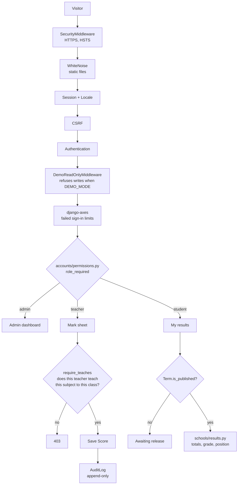
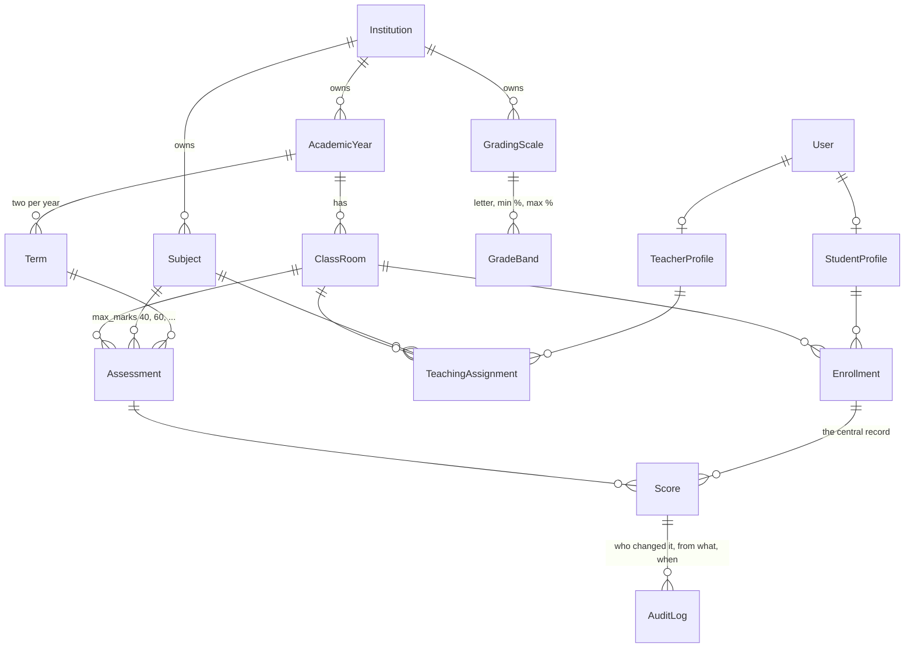

# GradeVault

[](https://github.com/Jama-Barre-hub/GradeVault/actions/workflows/ci.yml)
[](LICENSE)
[](https://www.python.org/)
[](https://www.djangoproject.com/)

**A role-based school results management system for Somali schools.**

Teachers record marks. Grades, averages and class positions are computed
automatically. Students sign in with a unique username and see only their own
results. Every change to a grade is permanently audited.

> **Status:** In development. Data model, computation, web interface,
> multi-school isolation and the public demo are complete and tested.
> See [PROPOSAL.md](PROPOSAL.md) for the full plan and roadmap.

---

## Try it

<!-- Replace with the deployed URL once the Render blueprint is created. -->
**Live demo:** _not yet deployed — see [Deployment](#deployment)_

| Role | Username | Password |
|---|---|---|
| Teacher | `demo-teacher` | `demo-password` |
| Student | `demo-student` | `demo-password` |
| Administrator | `demo-admin` | `demo-password` |

Sign in as the teacher, open a class mark sheet, then sign in as the student
and look at the same term. That is the whole system in two minutes.

The demo is **read-only**: every request that would change data is refused, for
every account, so a visitor can press any button without ending the demo for
whoever arrives next. Term 1 is published and fully marked; Term 2 is left
part-marked and unpublished, which is what a term in progress actually looks
like. Every name and mark is fictional.

| Done | |
|---|---|
| **Data model** | institutions, years, terms, classes, subjects, grading scales, students, teachers, enrolment, teaching assignments, assessments, marks |
| **Audit trail** | append-only; every grade change attributable and unremovable |
| **Computation** | subject totals, percentages, letter grades, term averages, class position |
| **Web interface** | portal layout, role dashboards, teacher mark entry, class rankings, student results |
| **Report cards** | printable, per student per term, with signature lines |
| **Public page** | explains the software to a visitor who has no account |
| **Sign-in limits** | ten failed attempts pause an account for twenty minutes |
| **Isolation** | each school sees only its own data, enforced and tested |
| **Public demo** | read-only deployment with a sign-in for each role |
| **Tests** | 262, including permission and tenancy tests that pass only when access is refused |

| Not done | |
|---|---|
| **Administrator interface** | school setup still happens in the Django admin rather than the portal |
| **PDF report cards** | printable in the browser; no download yet |
| **Somali translation** | withdrawn until it can ship complete — see [Language](#language) |
| **Independent security review** | every test here was written by the author |

---

## Why this exists

In many Somali primary and secondary schools, results live on paper registers or
in a spreadsheet on a single laptop. Files are lost, averages are computed by
hand and contain errors, students wait weeks for results, and there is no record
of who changed a mark. GradeVault addresses all four.

---

## Roles

| Role | Can do |
|---|---|
| **Administrator** | Set up academic years, terms, classes, subjects and grading scales; manage accounts; publish results |
| **Teacher** | Enter and amend marks for their assigned subjects and classes only |
| **Student** | View their own results, history and report card — nothing else |

---

## Tech stack

- **Django 6.1** (Python 3.13) — audited authentication, permissions and ORM
- **SQLite** in development, **PostgreSQL** in production
- **Django templates + HTML/CSS/JS** — server-rendered, so pages stay small on
  mobile connections, which is how most Somali users will access this
- **pytest + pytest-django** — permission rules are worthless unless proven
- **GitHub Actions** — tests run on every push

---

## Running locally

Requires **Python 3.13+** and **Git**. No Node.js needed.

```bash
git clone <repository-url>
cd GradeVault

# 1. Create and populate a virtual environment
python -m venv .venv
.venv\Scripts\activate          # Windows
# source .venv/bin/activate     # macOS / Linux
pip install -r requirements.txt

# 2. Create your environment file
cp .env.example .env

# 3. Generate a secret key and paste it into .env as DJANGO_SECRET_KEY
python -c "from django.core.management.utils import get_random_secret_key; print(get_random_secret_key())"

# 4. Set up the database and run
python manage.py migrate
python manage.py runserver
```

Open <http://127.0.0.1:8000>.

### If you intend to commit

```bash
pip install -r requirements-dev.txt
pre-commit install
```

`pre-commit install` is what activates the checks in
`.pre-commit-config.yaml`. Without it, nothing runs on commit and secrets or
lint errors can reach the repository.

Useful commands:

```bash
pytest                      # run the tests
ruff check .                # find problems
ruff format .               # fix formatting
pre-commit run --all-files  # run every check manually
```

### Demo data

```bash
python manage.py seed_demo --reset            # a school awaiting its results
python manage.py seed_demo --reset --publish  # Term 1 released, as the demo runs
```

Builds a complete school — 12 teachers, 120 students, 6 classes, 8 subjects,
mid-term and final assessments, and marks — in a couple of seconds. It prints
sign-in details when it finishes.

Without `--publish`, both terms stay unpublished, which is the state a real
school is in before an administrator releases results — students see "awaiting
release" rather than marks. `--publish` releases Term 1 only; Term 2 is
deliberately left part-marked, and publishing a half-marked term is exactly
what the published flag exists to prevent.

**Every name, admission number and mark it produces is fictional.** No real
student record is ever used, in development, in tests, or in the public demo.
The command only touches its own demo institution, so a school entered by hand
is left alone.

---

## Project layout

```
GradeVault/
├── config/            Django project configuration
│   ├── settings.py    Reads all secrets from the environment
│   ├── health.py      /healthz — is the process up and is the database reachable
│   └── urls.py
├── accounts/          Users, roles, profiles
│   ├── models.py      Custom User (admin/teacher/student), Teacher and Student profiles
│   ├── permissions.py Every access rule, in one place
│   └── demo.py        Read-only guard and credentials for the public demo
├── schools/           The domain
│   ├── models.py      Institutions, years, terms, classes, subjects, scales, marks
│   ├── results.py     Totals, percentages, letter grades, class positions
│   ├── views.py       Mark entry, class rankings, student results
│   ├── report_cards.py
│   └── admin_scoping.py   Keeps one school out of another's records
├── audit/             Append-only log of every grade change
├── templates/         Shared HTML templates
├── static/            CSS and images — no framework, no web fonts, no build step
├── tests/             262 tests
├── .env.example       Environment template — safe to commit
├── .env               Real secrets — git-ignored, never committed
└── manage.py
```

### How a request flows



### The data model



`Score` holds raw marks a teacher typed; results are **derived** from them at
read time rather than stored. That is what lets a school change its grading
scale and have every historical result recompute correctly.

---

## Deployment

The service and its database are described in [render.yaml](render.yaml), so a
deployment is reviewable in the repository rather than a set of dashboard
settings someone once clicked.

```
build:  ./build.sh                → install, collectstatic, migrate, seed the demo
start:  gunicorn config.wsgi:application
health: /healthz                  → process up and database reachable
```

### Deploying it yourself

1. On Render, choose **New → Blueprint** and point it at this repository.
   `render.yaml` describes the web service and its PostgreSQL database, so
   there is nothing to configure by hand.
2. Deploy. The secret key is generated by the platform, migrations run, and the
   demo school is seeded on the first build only.
3. Open the URL. No dashboard fields need filling in — Django trusts
   `RENDER_EXTERNAL_HOSTNAME`, which Render sets itself.

To run it for a **real school** instead, remove `DEMO_MODE` from `render.yaml`
so writes are permitted, and create the institution and its administrator
yourself rather than seeding one.

### Configuration

Everything is read from the environment. Nothing is hardcoded.

| Variable | Purpose |
|---|---|
| `DJANGO_SECRET_KEY` | Required. The app refuses to start without it |
| `DJANGO_DEBUG` | Must be `False` in production. Defaults to `False` |
| `DJANGO_ALLOWED_HOSTS` | Comma-separated hostnames. Optional on Render |
| `DATABASE_URL` | PostgreSQL. Falls back to SQLite when unset |
| `DEMO_MODE` | `True` makes the whole deployment read-only. Defaults to `False` |
| `DEMO_PASSWORD` | The password the demo advertises. Only read when `DEMO_MODE` is on |
| `EMAIL_HOST` etc. | Optional. Without it, mail goes to the console |

### What `DEMO_MODE=True` switches on

The demo publishes working credentials, so it has to survive whoever uses them.
Every request that could change data is refused — **for every account, the
administrator and a superuser included**. One rule with no exceptions cannot be
got wrong the way a per-account allowance can.

Signing in and out are the only exceptions, because both are `POST` and a demo
nobody can sign in to is not a demo.

A refused write is not a 403. The page is redisplayed with a message explaining
that nothing was saved, because opening a mark sheet and pressing Save is the
first thing a visitor tries and a wall of error text would read as a broken
site.

Six tests cover the refusals and, just as importantly, one covers the opposite:
with `DEMO_MODE` off a teacher's marks still save. A guard that quietly blocked
writes at a real school would break the only thing this software is for.

### What `DEBUG=False` switches on

Production hardening is tied to `DEBUG` rather than a separate flag, so there is
no way to deploy with it accidentally left off:

HTTPS enforced · HSTS for one year including subdomains · session and CSRF
cookies restricted to HTTPS · session cookie hidden from JavaScript · framing
refused · content-type sniffing disabled · referrers kept same-origin · static
files hashed and compressed.

Sixteen tests load `settings.py` with `DEBUG` off and assert each of these,
because a security setting that only applies in production is the easiest kind
to get wrong — nothing in development exercises it.

---

## Continuous integration

Every push runs [the CI workflow](.github/workflows/ci.yml):

lint and format · Django template lint · **check for missing migrations** ·
the full test suite **against real PostgreSQL** · `collectstatic` with the
production storage backend · `check --deploy` with warnings treated as failures.

Every one of those gates is what a deploy runs, so a green tick means the
deploy will work rather than only that the tests passed.

Tests run on PostgreSQL rather than SQLite because the two differ in ways that
matter — case sensitivity, constraint timing, ordering of nulls — so passing on
SQLite alone would not prove production is safe. This gives that parity without
installing a database server on a laptop.

---

## Language

The interface is **English only**.

A Somali option was built and withdrawn. The switcher worked and remembered
the choice, but almost none of the strings had been translated, so selecting
*Soomaali* changed nothing a user could see. On a page whose argument is that
this software can be trusted with children's records, a control that appears
broken costs more than the feature was worth.

The translation tags throughout the templates are deliberately kept, so Somali
can return later as finished work rather than as a button that half works.
Tests in `tests/test_interface_language.py` hold the current decision in place
and are meant to be deleted, not worked around, on the day a complete
translation exists.

---

## Data protection

This system holds educational records belonging to **minors**. Three rules apply
without exception:

1. **Only synthetic data** is used in development, tests, screenshots and the
   public demo. No real student's name, admission number or grade ever enters
   this repository.
2. **No hand-rolled security.** Password hashing, sessions and CSRF protection
   use Django's audited implementations.
3. **No secrets in Git.** Configuration is read from environment variables.
   `settings.py` raises an error and refuses to start if `DJANGO_SECRET_KEY` is
   missing, rather than falling back to an insecure default.

---

## Licence

[MIT](LICENSE) — free to use, modify and distribute, provided the copyright
notice is retained.

---

*Built by Jama Barre.*
